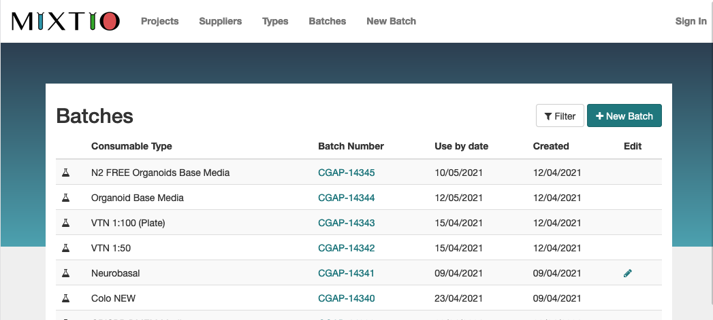

# Mixtio

> Reagent creation and barcoding service for DNA Pipeline.



## Prerequisites

- Ruby 2.7.2
- MySQL 5.7
- Chrome (for testing)

## Installation

1. The gems in the `gemfile` are separated into groups. In order to ignore the `deployment` group on install, run:

```bash
bundle config set without 'deployment'
```

2. `bundle install`


## Testing

1. Check the details in `database.yml` are correct for your local setup.

2. Initialise the test database:

```bash
RAILS_ENV=test rails db:create
RAILS_ENV=test rails db:schema:load
```

3. Run the tests

```bash
bundle exec rspec
```

## Running Locally

1. Initialise the development database:

```bash
RAILS_ENV=development rails db:create
RAILS_ENV=development rails db:schema:load
```

2. Add the seed data

```bash
RAILS_ENV=development rails db:seed
```

3. Create a new team and add yourself as a user:

~~~
rails console
> team = Team.create(name: "Team Name")
> user = User.create(username: "YOUR_SANGER_USERNAME", team: team)
~~~

4. Run `rails server` and navigate to http://localhost:3000

5. Log in with your username and no password.

Mixtio in production uses the Sanger LDAP server to authenticate users. In development, this is stubbed out and any password for a valid user will successfully authenticate them.

To turn this feature off, set `stub_ldap` to `false` in `development.rb`.

### Gems used
* Testing: [RSpec Rails](https://github.com/rspec/rspec-rails)
* Pagination: [Kaminari](https://github.com/kaminari/kaminari)
* Creating test data: [Factory Girl](https://github.com/thoughtbot/factory_girl)
* For testing web interactions: [Capybara](https://github.com/teamcapybara/capybara)
